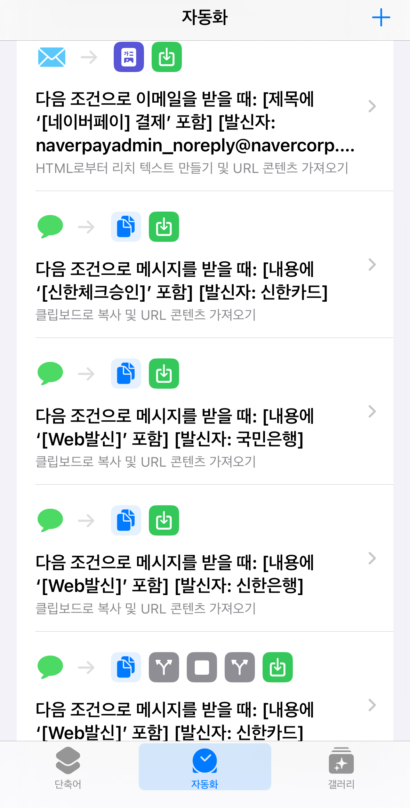

# Whooing API

이 프로젝트는 다음과 같은 기능을 제공하고 있거나, 제공할 예정입니다.

- SMS나 email로 신용카드/체크카드 결제, 네이버 페이 결제 내역을 받아 [Whooing](https://whooing.com)에서 제공하는
  API로 이를 전송
- 공용 서비스가 아닌, 개인이 직접 설치할 수 있는 형태의 API 서비스 제공

## 지원하는 형식

- 신한카드
- 신한체크카드
- 신한은행 이체
- KB국민은행 이체
- 네이버 페이

## iOS Web hook

iOS 웹훅을 사용하면, 아이폰 등의 iOS 기기에서 받은 문자 메시지나 이메일에 대해서
외부 API나 같은 기기 내의 다른 앱을 호출 할 수 있습니다. 본 프로젝트에서는 전자의
SMS 혹은 이메일 트리거 기능을 이용해서, Whooing 입력을 자동화 합니다.

## 설정

`whooing_api` 를 직접 운영하려면 서비스 실행하는 디렉터리 (working directory)에
`.env` 파일을 생성하고 아래 항목을 지정합니다.

### WHOOING_TOKEN

[후잉 환경설정 페이지](https://whooing.com/#main/setting) 맨 밑에 있는 "원격입력 설정(Webhook)" 부분에
`https://whooing.com/webhook/s/1234-1234-1234-1234-1234` POST URL 주소가 있습니다.
이 중 마지막 부분의 4자리 숫자 5개를 그대로 `-` 포함해서 `WHOOING_TOKEN` 플래그로 지정합니다.

### 맵핑 규칙

카드 결제나 계좌 이체를 사용하는 경우, 결제처나 이체 대상의 이름을 그대로 가계부에 사용하지 않을 수 있습니다.
혹은, 비용이나 수익 등의 계정을 지정하고자 하는 경우가 있습니다. 이 경우에 맵핑 규칙을 지정하면 편리합니다.

[Google Spreadsheet 예시](https://docs.google.com/spreadsheets/d/1gejqVnAr4bp9H3VTPt3eysGSgqkM8wbmTKQBP0KFQLI/edit?gid=0#gid=0)처럼 작성하고, 맨 뒤의 `edit?gid=0#gid=0` 대신 `export?format=tsv` 로 변경한 후,
해당 값을 `RULES` 에 지정하면 해당 맵핑을 자동으로 사용합니다.

## Disclaimer

본 프로젝트는 후잉의 공식 프로젝트가 아니며, 후잉을 좀 더 간편하게 사용하기 위한 보조 도구입니다.
